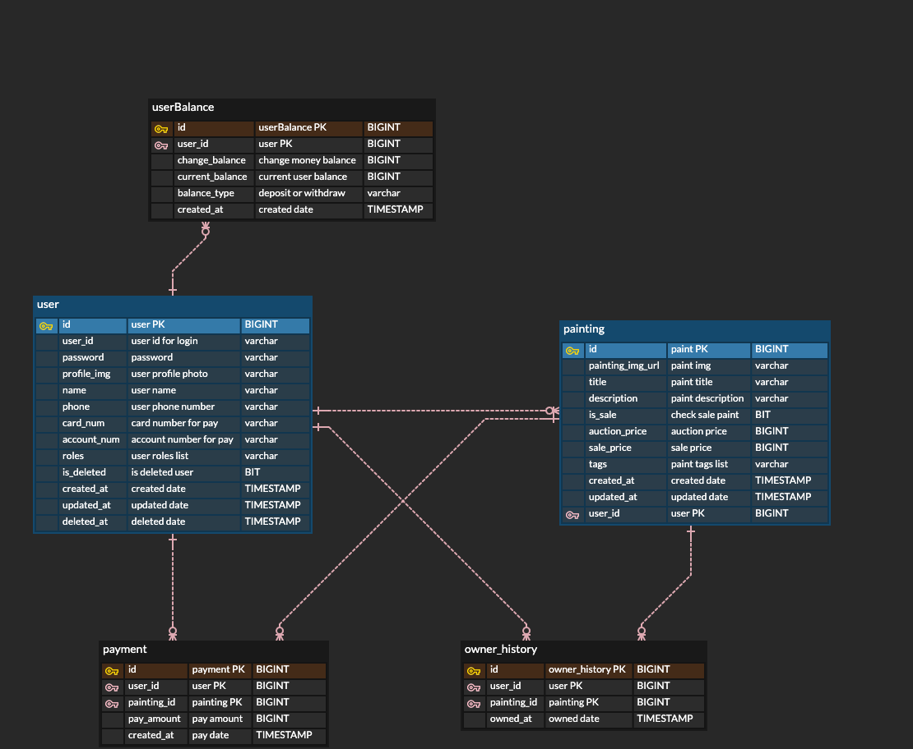

# 🎨 그림 매매 경매 서비스 Onbition
직접 그린 그림을 등록하고 사용자끼리 경매&매매 하는 온라인 전시회 서비스입니다.

## ⚙️ 프로젝트 기능 및 설계
### ✨회원관리
1. 회원가입 기능
   - 문자인증을 통해 본인인증 후 회원가입을 진행한다.
     - 문자 인증코드는 redis server 에서 처리
   - `이메일`, `비밀번호`, `프로필 사진`, `닉네임`, `전화번호` 값을 받아 회원을 등록한다.
   - `이메일`, `닉네임`은 중복될 수 없다.
   - 모든 사용자는 기본적으로 `VIEWER` 권한을 갖는다.
   - 이후에 활동을 통해 `BUYER`, `DREAMER`, `NEWBIE`, `AMATEUR`, `ARTIST` 권한을 추가한다.
     - BUYER(구매자): **카드 정보를 등록**하면 권한 획득
     - DREAMER(화가꿈나무): **그림을 하나 이상 등록**하면 권한 획득
     - NEWBIE(신입 화가): **그림이 하나 이상 판매완료**되면 권한 획득
     - AMATEUR(아마추어): **그림이 20개 이상 판매완료**되면 권한 획득
     - ARTIST(예술가): **그림이 50개 이상 판매완료**되면 권한 획득
   - `카드정보`, `계좌번호`는 처음 회원가입할때는 null 로 설정한다.
2. 로그인 기능
    - `이메일`, `비밀번호` 일치여부 확인 후 로그인 성공/실패한다.
    - 로그인 성공 후 `access token`, `refresh token` 발행한다.
    - access token 만료시간은 30분, refresh token 만료시간은 3일
    - access token(key) - refresh token(value) 로 redis 에 저장한다.
3. 로그아웃 기능
   - access token 을 `redis blacklist` 에 추가시킨다.
     - Header 로 access token 을 받을 때 마다 로그아웃 된 access token 인지 확인한다.
   - refresh token 을 `redis` 에서 삭제한다.
4. 회원정보 조회 기능
   - access token 일치 여부 확인 후 사용자 정보를 조회한다.
     - `프로필 사진`, `닉네임`, `사용자 등급 권한`, `조회하는 사용자의 그림 목록`을 조회한다.
5. 회원정보 수정 기능
   - access token 일치 여부 확인 후 본인 정보만 수정할 수 있다.
     - `프로필 사진`, `닉네임`, `비밀번호` 를 변경할 수 있다.

### ✨그림관리
1. 그림 등록 기능
   - `그림(이미지)`, `제목`, `설명`, `판매여부`, `경매/매매 가격`, `태그 리스트` 를 작성하여 제출한다.
     - 그림 이미지 파일은 AWS s3 에 저장하고 관리한다.
     - 그림 설명은 300이내로 작성한다.
     - 판매여부에서 그림을 판매할지 전시만 할지 결정한다.
     - 판매할 그림으로 선택하면 경매가와 매매가를 둘 다 정해서 등록한다.
       - 매매가를 경매가보다 높은 가격으로 등록한다.
     - 태그 리스트는 사용자가 직접 입력하며, 최대 10개까지만 등록할 수 있다.
2. 그림 정보 수정 기능
   - 그림 제목, 설명은 원작자의 의도가 포함되어 있기 때문에 수정 불가능하다.
   - `판매여부` false 에서 true 로 변경하는 것과 `매매가`(즉시구매가), `태그`만 수정할 수 있다.
   - 경매가 시작된 그림은 정보를 수정할 수 없다.
3. 그림 검색 기능
   - Elastic Search 를 이용해 검색기능을 구현한다.
   - 일반적인 검색은 '제목'으로부터 검색된다.
   - 태그를 검색하고싶으면 맨앞에 #을 추가해 검색한다.
4. 그림 조회 기능
   - 그림 이미지, 제목, 설명, 히스토리 정보를 조회한다.
     - 히스토리는 얼마에 누구한테 판매되었는지 에 대한 히스토리를 확인할 수 있다.
   - 조회수, 하트수를 조회할 수 있다.
     - 조회수는 사용자당 하나만 올릴 수 있다.
     - 하트수는 사용자가 직접 좋아요를 누르는 방식이고 다시 누르면 좋아요가 취소된다.
     - 판매되고 있는 그림이면 경매가, 매매가(즉시구매가)를 확인할 수 있다.
   - 댓글을 조회할 수 있다.
     - 댓글은 paging 처리한다.
     - 대댓글을 작성할 수 없다.
5. 모든 그림 조회 기능
   - 모든 그림 리스트는 하트수(좋아요 수)에 따른 인기순으로 정렬된다.
     - 하트수에 따른 오름차순 / 내림차순 을 선택할 수 있다.
     - 최신그림순 / 오래된그림순 을 선택할 수 있다.
     - 판매되고 있는 그림만 볼 수 있게 설정할 수 있다.
     - 가격 범위를 정할 수 있다.
   - 등록된 그림 수가 많을 수 있으므로 paging 처리한다.

### ✨그림 매매
1. 사용자는 경매입찰, 즉시구매로 그림을 구매할 수 있다.
2. 그림을 구매하면 다시 그 그림의 소유자가 되어 그림을 재판매할 수 있다.
3. 그림이 판매되면 `판매여부`가 무조건 false 로 변경된다.
4. 그림이 판매되면 유저 권한이 변경될 수 있다.

### ✨경매시스템
1. 마지막 입찰 후 `24시간`동안 새로운 입찰이 없으면 제일 마지막에 입찰한 사용자에게 낙찰된다.
2. 경매는 한사람이 여러번 입찰할 수 있지만 바로전에 입찰한 사용자라면 바로 입찰할 수 없다.
   - 동시성 처리로 입찰가를 실시간으로 갱신한다.
3. 특정가격 이상이 되면 입찰가가 증가한다.
   - 현재 가격의 `10%`로 결정된다.
4. 사용자는 본인이 현재 참여하고 있는 경매의 그림 목록을 조회할 수 있다.
5. 낙찰자가 `48시간` 이내로 결제를 진행하지 않으면 해당 그림의 경매가 처음 등록한 시작가로 재등록된다.

### ✨결제시스템
1. 결제에 사용될 카드정보를 등록한다.
   - 카드번호 16자리와 결제 비밀번호를 입력한다.
     - 카드번호와 결제 비밀번호는 암호화되어 저장된다.
   - 카드를 등록하면 `BUYER` 권한을 획득한다.
   - 카드정보를 수정할 수 있다.
2. 판매된 금액을 받을 계좌번호를 등록한다.
   - 계좌정보를 수정할 수 있다.
3. 결제가 진행되면 결제 히스토리 테이블에 `판매자`, `구매자`, `금액`이 저장된다.

# ERD

# Trouble Shooting
[Trouble Shooting Information](doc/TROUBLE_SHOOTING.md)